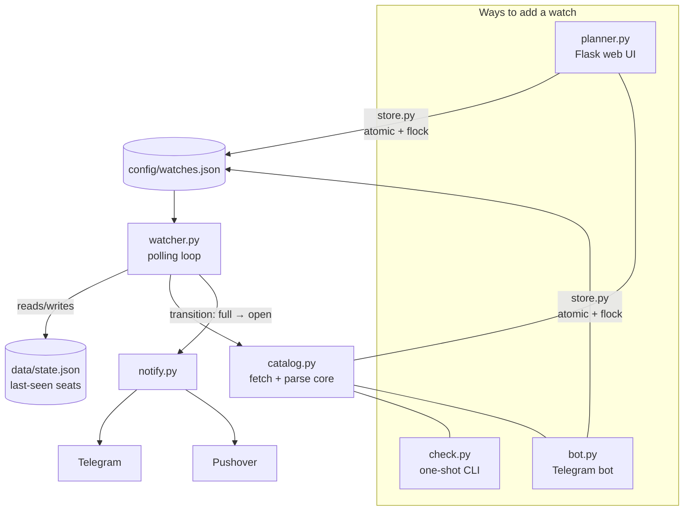

<div align="center">

# 🎒 PackSeats

**Get a phone notification the *second* a seat opens in a full NC State class — instead of refreshing the course catalog for a week straight during registration.**

Ships with a conflict-aware schedule planner for finding sections that actually fit around the classes you already have.

[](https://www.python.org/)
[](https://flask.palletsprojects.com/)
[](LICENSE)
[](#-self-hosting-still-0)
[](#-scope--ethics)

</div>

<!-- Drop a planner screenshot here for the showcase:  -->

---

## The problem

At NC State, the class you need is full, so you camp on the course catalog hitting refresh, hoping to catch the one moment someone drops it before the next person does. It's tedious, you lose either way, and it happens every single registration cycle.

PackSeats watches for you. It polls the **public** class search on a polite interval, notices the instant a watched section flips from *full* to *open*, and pushes a notification straight to your phone — with a tap-through link to go grab the seat. No login, no MyPack, no SSO. Public catalog only.

> **Unofficial.** Not affiliated with, endorsed by, or supported by NC State University. It reads only the public catalog, stores no credentials, and is shared as-is under the [MIT license](LICENSE).

---

## What it does

### 🔔 Watcher — never miss the drop

Checks each watched section every ~3 minutes (+ random jitter) and notifies **only on the transition into open**, so a seat that sits open doesn't spam you every poll. Alerts carry the course title, section, meeting days/time, and class number, plus a tap-through link to MyPack → Manage Classes:

```
🟢 CSC 316-001 just opened: 3/100 seats (Closed → Open)
CSC 316-001 — Data Structures For Computer Scientists
MW 3:00 PM - 4:15 PM · class #1681
```

### 🗓️ Planner — find classes that actually fit

A single-page Flask UI (localhost) where you:

- **Enter what you're enrolled in** — meeting times are fetched from the catalog automatically and drawn on a Mon–Fri week grid.
- **Search any course** and instantly see which sections **fit** vs. **conflict** with your schedule (conflicts are named), each with live seat status.
- **Replacing mode** — hunt for a swap for one specific class you want out of.
- **One-click watch** — watch any section, or *"Watch all N that fit,"* and manage them in the Watching panel. It writes the same config the watcher reads.

### 👥 Shared bot — bring your friends, zero setup on their end

Host it once and friends can use it with **no VM, no tokens, no install** — they just message your Telegram bot:

```
Friend →  /start <your-invite-code>
Bot    →  You're in! 🎉  (try /watch)
Friend →  /watch 2268 CSC 316 001
Bot    →  ✅ Watching CSC 316-001 — Data Structures (Closed 0/100). I'll ping you.
```

Their watches flow into the same store the watcher already polls, and a seat alert **fans out to everyone** watching that section. Friends can even open the full web planner (`/ui` → a one-time passwordless login link). It's opt-in, invite-gated, and revocable (`/kick`).

---

## Architecture

Four entry points, one shared core, no server-to-server calls — the components integrate purely through a lock-guarded JSON file on disk. No database.



**Why it's built this way:**

| Decision | Why it matters |
| --- | --- |
| **One fetch/parse core** (`catalog.py`) | The CLI, planner, bot, and watcher all share the exact same seat/meeting-time parsing — reverse-engineered from the catalog's JSON-wrapped HTML response. One place to get right. |
| **Edge-triggered alerts** | Notify on the *transition* full→open, not on every poll while a seat sits open. State lives in `data/state.json`. No spam. |
| **Politeness by design** | Conservative interval, random jitter, an identifying `User-Agent`, and **one request per course per pass** even when several of its sections are watched — the catalog has no section-level query param, so sections are deduped to their course. |
| **JSON as the integration point** | The UI/bot write and the watcher reads the same `config/watches.json`. All writes go through `store.py` (atomic temp-file rename + `flock`) so concurrent bot + planner edits never corrupt it. No DB to run. |
| **Resilient loop** | A single failed fetch logs and continues. One bad request — or one malformed bot message — never crashes the watcher. |
| **Passwordless web auth** | Friends log in via a short-lived, signed token link (no accounts, no passwords to phish). Every route is authenticated and scoped to the caller's chat-id; `/kick` revokes access on the next request. |

---

## Quickstart

Requires Python 3.8+.

```bash
git clone https://github.com/laizie/packseats.git
cd packseats

python3 -m venv .venv && .venv/bin/pip install -r requirements.txt
cp .env.example .env          # then add a notification token — see below

# one-shot check: all sections of a course, or a single section
.venv/bin/python -m packseats.check 2268 CSC 316 --section 001

# the planner UI  →  http://127.0.0.1:5050
.venv/bin/python -m packseats.planner

# the watcher: poll config/watches.json forever
.venv/bin/python -m packseats.watcher --loop
```

Add the sections you care about through the planner UI (it writes `config/watches.json`), then leave the watcher running.

**Term codes:** `2` + two-digit year + `1` Spring / `6` Summer 1 / `7` Summer 2 / `8` Fall. So `2268` = Fall 2026. (The planner's dropdown does this for you.)

### Notifications

You only need one channel. If none is configured, alerts print to stdout.

- **Telegram (recommended)** — free, ~2 minutes: message [@BotFather](https://t.me/BotFather), `/newbot`, copy the token; message your bot once, then read your chat id from `https://api.telegram.org/bot<TOKEN>/getUpdates`. Put both in `.env`.
- **Pushover (optional)** — a one-time paid license, but supports *emergency priority* that re-alerts until acknowledged and bypasses Do Not Disturb.

Everything is spelled out in [`.env.example`](.env.example). Blank channels are skipped.

---

## 🏠 Self-hosting (still $0)

To keep watching with your laptop closed, run it on a free always-on VM. The [`deploy/`](deploy) directory has a one-shot `setup.sh` plus systemd units for an **Oracle Cloud Always Free** VM (free forever). PackSeats is tiny and runs comfortably in that tier — more friends on the shared bot doesn't cost more.

```bash
# on the VM, once
sudo bash /opt/packseats/deploy/setup.sh    # deps + a non-login service user + systemd units
```

The included `scripts/vm` helper (`vm ui | logs | status | watches | update | ssh`) is a convenience wrapper for driving the VM over SSH — adapt it to your own host alias.

### Safe self-hosting — the essentials

These keep it $0, private, and unexposed. Mostly *"don't undo the safe defaults."*

1. **Never expose the planner.** The planner UI has **no authentication by design** — anyone who reaches it can rewrite your watch list. It binds to `127.0.0.1` only; reach it remotely with an **SSH tunnel** (`ssh -L 5050:localhost:5050 <vm>`), never by opening port 5050. The app warns if you point `PACKSEATS_PLANNER_HOST` at a non-loopback address. *(The optional public web planner is the one exception — it's safe by construction: Flask stays on localhost, a **Caddy** reverse proxy fronts it with automatic HTTPS, and it refuses to bind a public interface without a signing secret set.)*
2. **Never commit secrets.** Tokens live in `.env`, which is gitignored along with `config/watches.json` and `data/`. Verify before your first push:
   ```bash
   git check-ignore .env config/watches.json      # should print both
   ```
3. **Set an Oracle budget alert.** Console → Billing → Budgets → a $1 budget alerting near 0%. If a single cent ever accrues, you hear about it that day. Launch only an *Always Free-eligible* shape and leave the account on the Free tier.
4. **Harden the box.** SSH key-only (disable password auth), keep port 22 as the only open ingress, run the services as the dedicated non-login `packseats` user, and deploy with a **read-only** GitHub deploy key so a compromised VM can't push to your repo.

---

## Project layout

```
├── README.md                    # this file
├── LICENSE                      # MIT
├── packseats/
│   ├── catalog.py               # fetch + parse core (seats, meeting times, titles)
│   ├── check.py                 # one-shot CLI seat check
│   ├── watcher.py               # polling loop + transition detection + alert fan-out
│   ├── notify.py                # Telegram + Pushover senders (.env-configured)
│   ├── bot.py                   # optional shared Telegram bot (friends manage watches)
│   ├── store.py                 # atomic, lock-guarded JSON state (bot + planner write it)
│   ├── planner.py               # Flask app: schedule, search, watch management
│   └── templates/planner.html   # the single-page UI
├── scripts/vm                   # day-to-day VM helper over SSH
├── deploy/                      # systemd units + VM setup + Caddyfile
├── config/watches.json          # what's being watched (gitignored; example provided)
└── data/                        # last-seen seat state + saved schedules (gitignored)
```

**Tech:** Python 3 · `requests` + `BeautifulSoup` (the catalog returns JSON-wrapped HTML) · Flask (single-page planner) · JSON files for all state (no DB) · systemd + Oracle Cloud Always Free · optional Caddy for HTTPS.

---

## 🧭 Scope & ethics

- **Public catalog only.** PackSeats reads only NC State's public class search. It never touches MyPack Portal, Shibboleth SSO, or Duo, and stores no credentials. The MyPack link in an alert is a convenience link for a human to tap — the code never requests it.
- **Polite to the server.** Conservative interval, jitter, one request per course per pass, identifying `User-Agent`. Don't tighten it into hammering, especially during peak registration.
- **Unofficial and personal.** Shared as-is; no affiliation with NC State.

## License

[MIT](LICENSE) — use it, fork it, adapt it. Just keep it public-catalog-only and be kind to the servers.
