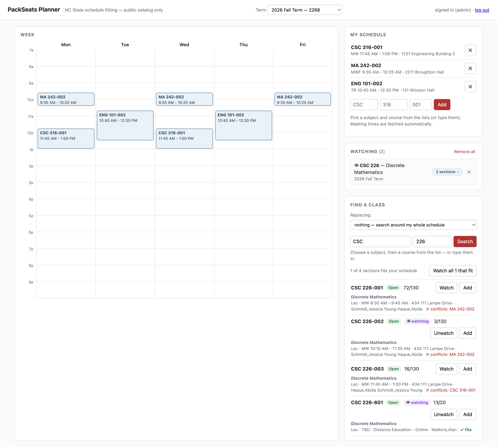
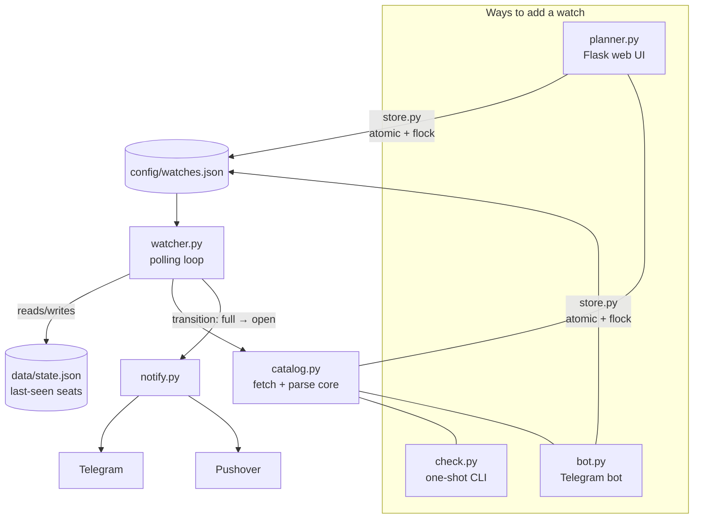

<div align="center">

# 🎒 PackSeats

**A personal tool that pings my phone the *second* a seat opens in a full NC State class — instead of refreshing the course catalog for a week straight during registration.**

Comes with a conflict-aware schedule planner for finding sections that actually fit around the classes I already have, and an opt-in shared bot so friends can use it too.

[](https://www.python.org/)
[](https://flask.palletsprojects.com/)
[](LICENSE)
[](#running-it)
[](#scope--ethics)

</div>

<!-- Drop a planner screenshot here for the showcase:  -->

---

## The problem

At NC State, the class you need is full, so you camp on the course catalog hitting refresh, hoping to catch the one moment someone drops it before the next person does. It's tedious, you lose either way, and it happens every single registration cycle.

PackSeats watches for me. It polls the **public** class search on a polite interval, notices the instant a watched section flips from *full* to *open*, and pushes a notification straight to my phone — with a tap-through link to go grab the seat. No login, no MyPack, no SSO. Public catalog only.

> **Unofficial.** Not affiliated with, endorsed by, or supported by NC State University. It reads only the public catalog and stores no credentials.

---

## What it does

### 🔔 Watcher — never miss the drop

Checks each watched section every ~3 minutes (+ random jitter) and notifies **only on the transition into open**, so a seat that sits open doesn't spam every poll. Alerts carry the course title, section, meeting days/time, and class number, plus a tap-through link to MyPack → Manage Classes:

```
🟢 CSC 316-001 just opened: 3/100 seats (Closed → Open)
CSC 316-001 — Data Structures For Computer Scientists
MW 3:00 PM - 4:15 PM · class #1681
```

### 🗓️ Planner — find classes that actually fit

A single-page Flask UI where I:

- **Enter what I'm enrolled in** — meeting times are fetched from the catalog automatically and drawn on a Mon–Fri week grid.
- **Search any course** and instantly see which sections **fit** vs. **conflict** with my schedule (conflicts are named), each with live seat status.
- **Replacing mode** — hunt for a swap for one specific class I want out of.
- **One-click watch** — watch any section, or *"Watch all N that fit,"* and manage them in the Watching panel.

### 👥 Shared bot — friends, with zero setup on their end

Hosted once, friends can use it with **no VM, no tokens, no install** — they just message the Telegram bot:

```
Friend →  /start <invite-code>
Bot    →  You're in! 🎉  (try /watch)
Friend →  /watch 2268 CSC 316 001
Bot    →  ✅ Watching CSC 316-001 — Data Structures (Closed 0/100). I'll ping you.
```

Their watches flow into the same store the watcher already polls, and a seat alert **fans out to everyone** watching that section. Friends can even open the full web planner (`/ui` → a one-time passwordless login link). It's opt-in, invite-gated, and revocable.

---

## How it's built

Four entry points, one shared core, no server-to-server calls — the components integrate purely through a lock-guarded JSON file on disk. No database.



The decisions I'm happiest with:

| Decision | Why it matters |
| --- | --- |
| **One fetch/parse core** (`catalog.py`) | The CLI, planner, bot, and watcher all share the exact same seat/meeting-time parsing — reverse-engineered from the catalog's JSON-wrapped HTML response. One place to get right. |
| **Edge-triggered alerts** | Notify on the *transition* full→open, not on every poll while a seat sits open. Last-seen state lives in `data/state.json`. No spam. |
| **Politeness by design** | Conservative interval, random jitter, an identifying `User-Agent`, and **one request per course per pass** even when several of its sections are watched — the catalog has no section-level query param, so sections are deduped to their course. |
| **JSON as the integration point** | The UI/bot write and the watcher reads the same `config/watches.json`. All writes go through `store.py` (atomic temp-file rename + `flock`) so concurrent bot + planner edits never corrupt it. No DB to run. |
| **Resilient loop** | A single failed fetch logs and continues. One bad request — or one malformed bot message — never crashes the watcher. |
| **Passwordless web auth** | Friends log in via a short-lived, signed token link (no accounts, no passwords to phish). Every route is authenticated and scoped to the caller's chat-id; a `/kick` revokes access on the next request. |

**Stack:** Python 3 · `requests` + `BeautifulSoup` (the catalog returns JSON-wrapped HTML) · Flask (single-page planner) · JSON files for all state, no database · systemd on an Oracle Cloud Always Free VM · optional Caddy reverse proxy for automatic HTTPS.

---

## Running it

It lives on a free always-on VM (two systemd services — the polling watcher and the localhost planner), so it keeps watching with my laptop closed, at **$0**. The planner is authentication-free by design and stays bound to localhost, reached over an SSH tunnel; the optional friends-facing web planner sits behind a Caddy reverse proxy with automatic HTTPS and passwordless signed-link login.

This repo is here as a **showcase** rather than a product — it's wired to my NC State catalog, my notification tokens, and my host. If you want to run your own, the code, the `deploy/` systemd units, and the `.env.example` lay out how, but you're on your own terms from there.

---

## Scope & ethics

- **Public catalog only.** PackSeats reads only NC State's public class search. It never touches MyPack Portal, Shibboleth SSO, or Duo, and stores no credentials. The MyPack link in an alert is a convenience link for a human to tap — the code never requests it.
- **Polite to the server.** Conservative interval, jitter, one request per course per pass, identifying `User-Agent`. Never tightened into hammering, especially during peak registration.
- **Unofficial and personal.** No affiliation with NC State.

## License

[MIT](LICENSE).
